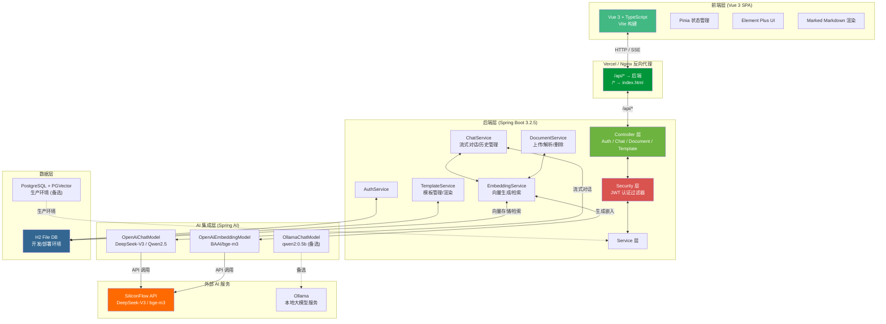
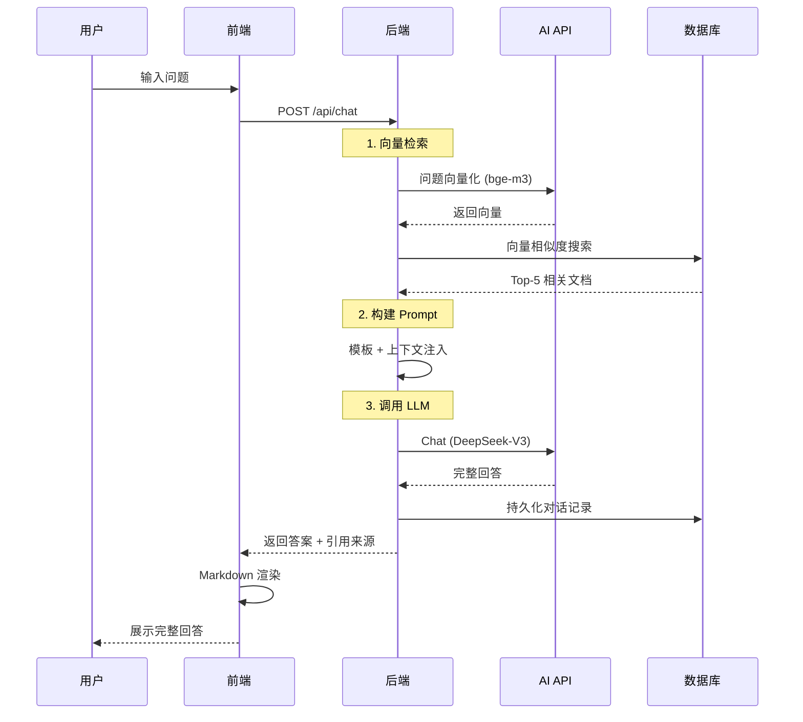

# RAG 智能知识库问答系统

基于检索增强生成（RAG）技术的智能问答平台，支持文档知识库管理、向量检索、AI 对话、用户权限管控等核心能力。

[](https://spring.io/projects/spring-boot)
[](https://vuejs.org/)
[](https://vitejs.dev/)
[](LICENSE)

---

## 📋 目录

- [项目简介](#项目简介)
- [技术栈](#技术栈)
- [系统架构](#系统架构)
- [核心功能](#核心功能)
- [部署链接](#部署链接)
- [本地快速启动](#本地快速启动)
- [在线部署指南](#在线部署指南)
- [API 文档](#api-文档)
- [Prompt 模板设计](#prompt-模板设计)
- [项目结构](#项目结构)
- [AI 辅助开发说明](#ai-辅助开发说明)
- [评分参考](#评分参考)

---

## 📖 项目简介

本项目是一个 **RAG（检索增强生成）智能知识库问答系统**，用户上传文档后，系统自动对文档进行分块和向量化，用户提问时通过语义检索找到最相关的文档片段，结合大语言模型生成精准回答。

**选做主题：** 智能知识库管理系统 (RAG-based Wiki)

**核心特性：**
- 📄 多格式文档上传（PDF / Word / TXT）
- 🔍 语义向量检索（Top-K 匹配）
- 🤖 AI 大模型智能问答（支持本地 Ollama / 云端 API）
- 💬 流式对话体验
- 👥 多用户 JWT 权限管控
- 📝 Prompt 模板可自定义管理

---

## 🛠️ 技术栈

### 后端
| 技术 | 用途 |
|------|------|
| Spring Boot 3.2.5 | 核心框架 |
| Spring AI 1.0.0 | AI 模型集成（Chat / Embedding） |
| Spring Security + JWT | 无状态认证授权 |
| Spring Data JPA + Hibernate | ORM 持久化 |
| H2 File DB / PostgreSQL | 关系数据库 |
| PGVector（可选） | 向量数据库 |
| Apache PDFBox / POI | PDF / Word 文档解析 |
| SpringDoc OpenAPI | API 文档自动生成 |

### 前端
| 技术 | 用途 |
|------|------|
| Vue 3 + TypeScript | 前端框架 |
| Vite 5 | 构建工具 |
| Pinia | 状态管理 |
| Element Plus | UI 组件库 |
| Axios | HTTP 请求 |
| Marked + highlight.js | Markdown 渲染 |
| Vitest | 单元测试 |

### 部署与 AI
| 技术 | 用途 |
|------|------|
| Docker + Docker Compose | 容器化部署 |
| Vercel | 前端托管 |
| Render | 后端托管 |
| SiliconFlow API | AI 对话模型（DeepSeek-V3 / Qwen2.5） |
| Ollama（可选） | 本地大模型备选方案 |

---

## 🏗️ 系统架构



### 交互流程

**智能问答流程：**



---

## ✨ 核心功能

### 1. 用户权限模块
- 用户注册、登录、注销
- JWT 无状态认证（Access Token 24h / Refresh Token 7d）
- 自动刷新令牌
- 路由守卫保护

### 2. 知识库管理模块
- 支持 TXT、PDF、Word 文档上传
- 系统预置样本文档（云计算、Java、RAG、Spring）
- 自动文档分割和向量化存储
- 文档分类管理

### 3. 智能问答模块
- 语义检索匹配相关文档
- 结合上下文生成答案
- 流式/非流式两种对话方式
- 历史对话管理

### 4. Prompt 模板管理
- 自定义提示词模板
- `{{variable}}` 占位符替换
- 分类管理（rag / general / translate）
- 使用统计

---

## 🌐 部署链接

| 组件 | 地址 | 技术 |
|------|------|------|
| 🖥️ **前端** | [https://rag-knowledge-base.vercel.app](https://rag-knowledge-base.vercel.app) | Vercel |
| ⚙️ **后端 API** | [https://rag-knowledge-base.onrender.com](https://rag-knowledge-base.onrender.com) | Render (Docker) |

> ⚠️ Render 免费实例在无访问时会休眠，首次请求可能需要等待 30-60 秒唤醒。

---

## 🚀 本地快速启动

### 方式一：使用 OpenAI 兼容 API（推荐，快速）

```bash
# 1. 设置 API Key（硅基流动 / DeepSeek / OpenAI 均可）
set OPENAI_API_KEY=sk-your-key-here

# 2. 启动后端
mvnw spring-boot:run -Dspring-boot.run.profiles=openai

# 3. 另开终端，启动前端
cd frontend
npm install
npm run dev
```

- 前端访问：http://localhost:3000
- 后端 API：http://localhost:8080
- 默认使用 H2 文件数据库，无需额外安装

### 方式二：使用本地 Ollama（离线）

```bash
# 1. 启动 Ollama
ollama serve
ollama pull qwen2:0.5b
ollama pull nomic-embed-text

# 2. 启动后端（默认 profile 使用 Ollama）
mvnw spring-boot:run

# 3. 启动前端
cd frontend && npm run dev
```

### 方式三：Docker Compose 一键启动

```bash
docker-compose up -d
```

启动后访问 **http://localhost**

---

## ☁️ 在线部署指南

### 前提条件

1. 一个 **GitHub 账号**
2. 一个 **Vercel 账号**（GitHub 登录即可）
3. 一个 **Render 账号**（GitHub 登录即可）
4. 一个 **硅基流动 API Key**（[siliconflow.cn](https://siliconflow.cn) 注册，新用户送 $14 额度）

### 第一步：创建个人仓库

1. 登录 GitHub → 点 `+` → **New repository**
2. 仓库名：`rag-knowledge-base`
3. 设为 Private 或 Public
4. 不要勾选初始化 README

```bash
# 在项目目录添加个人远程仓库
git remote add personal https://github.com/你的用户名/rag-knowledge-base.git

# 推送代码
git push personal main
```

> 日常推 `personal`，交作业时推 `origin`，两份代码保持一致。

### 第二步：部署后端到 Render

1. 登录 [dashboard.render.com](https://dashboard.render.com)
2. 点 **New +** → **Web Service**
3. 连接你的 GitHub 仓库
4. 配置：

| 配置项 | 值 |
|--------|-----|
| Name | `rag-knowledge-base` |
| Environment | **Docker** |
| Branch | `main` |
| Dockerfile Path | `./Dockerfile` |

5. 添加环境变量：

| 变量 | 值 |
|------|-----|
| `OPENAI_API_KEY` | 你的硅基流动 API Key |
| `SPRING_PROFILES_ACTIVE` | `openai` |
| `JWT_SECRET` | 自动生成 ✓ |

6. 选择 **Free** 计划 → **Create Web Service**

部署完成后，后端 URL 类似：`https://rag-knowledge-base.onrender.com`

### 第三步：部署前端到 Vercel

1. 登录 [vercel.com](https://vercel.com)
2. 点 **Add New...** → **Project**
3. 导入你的 GitHub 仓库
4. 配置：

| 配置项 | 值 |
|--------|-----|
| Root Directory | `frontend` |
| Framework | **Vite** |
| Build Command | `npm run build` |
| Output Directory | `dist` |

5. 点 **Deploy**

部署完成后，前端 URL 类似：`https://rag-knowledge-base.vercel.app`

### 第四步：配置前端 API 代理

在 Vercel 项目设置中，或修改 `vercel.json`：

```json
{
  "rewrites": [
    { "source": "/api/(.*)", "destination": "https://rag-knowledge-base.onrender.com/api/$1" },
    { "source": "/(.*)", "destination": "/index.html" }
  ]
}
```

---

## 📚 API 文档

启动后端后访问 Swagger UI：http://localhost:8080/swagger-ui.html

### 核心接口

| 方法 | 路径 | 说明 |
|------|------|------|
| POST | `/api/auth/register` | 用户注册 |
| POST | `/api/auth/login` | 用户登录 |
| POST | `/api/chat` | 发送消息 |
| GET | `/api/chat/history/{id}` | 获取对话历史 |
| GET | `/api/chat/conversations` | 获取会话列表 |
| DELETE | `/api/chat/history/{id}` | 删除对话 |
| POST | `/api/documents` | 上传文档 |
| GET | `/api/documents` | 获取文档列表 |
| DELETE | `/api/documents/{id}` | 删除文档 |
| GET | `/api/templates` | 获取模板列表 |
| GET | `/api/config/ai` | 获取 AI 配置 |

---

## 🤖 Prompt 模板设计

详见 [docs/Prompt 报告.md](docs/Prompt%20报告.md)

系统内置的 RAG 默认模板：

```
你是一个智能问答助手。请根据以下参考资料回答问题。

{{context}}

请基于以上资料，用中文简洁明了地回答问题。
如果资料中没有相关信息，请如实说明。
回答时标注引用来源编号，如 [1][2]。
```

**设计迭代：**
- **v1.0**：仅包含"根据参考资料回答问题"的简单指令
- **v1.1（当前）**：增加三个关键约束——无资料时如实说明（减少幻觉）、标注引用来源编号（提高可追溯性）、用中文回答（明确语言要求）

**自定义模板：** 用户可通过「Prompt 模板管理」页面运行时创建和修改模板，支持 `{{variableName}}` 占位符语法，定义后实时生效无需重启。

---

## 📁 项目结构

```
personal-project-ZhangYN1203-main/
├── src/main/java/com/example/app/
│   ├── config/             # 配置类（安全、JWT、AI、数据初始化）
│   ├── controller/         # REST API 控制器
│   ├── service/            # 业务逻辑层
│   ├── repository/         # 数据访问层
│   ├── entity/             # JPA 实体
│   └── dto/                # 数据传输对象
├── frontend/               # Vue3 前端项目
│   ├── src/
│   │   ├── api/            # API 调用 + 类型定义
│   │   ├── views/          # 页面组件
│   │   ├── components/     # 通用组件
│   │   ├── stores/         # Pinia 状态管理
│   │   └── router/         # 路由配置
├── docker-compose.yml      # Docker 编排
├── Dockerfile              # 后端 Docker 镜像
├── render.yml              # Render 部署配置
├── vercel.json             # Vercel 部署配置
└── docs/
    ├── Prompt 报告.md
    ├── 系统架构图.md
    └── 5.23记录.md
```

---

## 🤝 AI 辅助开发说明

本项目在开发过程中使用了 AI 辅助编程工具：

| 工具 | 用途 | 比例 |
|------|------|------|
| Claude Code (CLI) | 代码生成、调试、重构、文档编写 | ~60% |
| 人工编码 | 需求分析、架构设计、AI 生成的审查与修改 | ~40% |

**使用方式：**
- AI 负责生成代码框架、编写测试、修复 Bug、文档撰写
- 人工负责整体架构设计、核心逻辑审查、安全策略、部署配置

**优势：** AI 辅助大幅提升了开发效率，特别是在配置调试（Spring AI、Docker、SSE 流式）和文档撰写方面节省了大量时间。

---

## 📊 评分参考

| 评分维度 | 分值 | 说明 |
|---------|------|------|
| 功能完整性 | 25 | 完整实现用户认证、文档管理、智能问答、模板管理四大模块 |
| AI 深度集成 | 20 | 集成 Spring AI，支持流式输出 + RAG 检索 + Prompt 模板管理 |
| 架构与代码质量 | 20 | 清晰的分层架构（Controller → Service → Repository），DDD 风格 |
| UI/UX 设计 | 10 | 类 ChatGPT 对话界面，Markdown 渲染，响应式设计 |
| 数据库设计 | 10 | JPA Entity 设计，向量存储，H2/PG 双模式兼容 |
| 文档与演示 | 15 | 完整 README + 架构图 + Prompt 报告 + 解决记录 |
| **额外加分** | **+10** | **✅ 部署至 Vercel + Render (+5) ✅ 向量检索 (RAG) (+5)** |

---

## 📄 许可证

MIT License

---

## 📬 联系方式

- 项目仓库：[GitHub](https://github.com/ZhangYN1203/rag-knowledge-base)
- 如有问题请提交 Issue