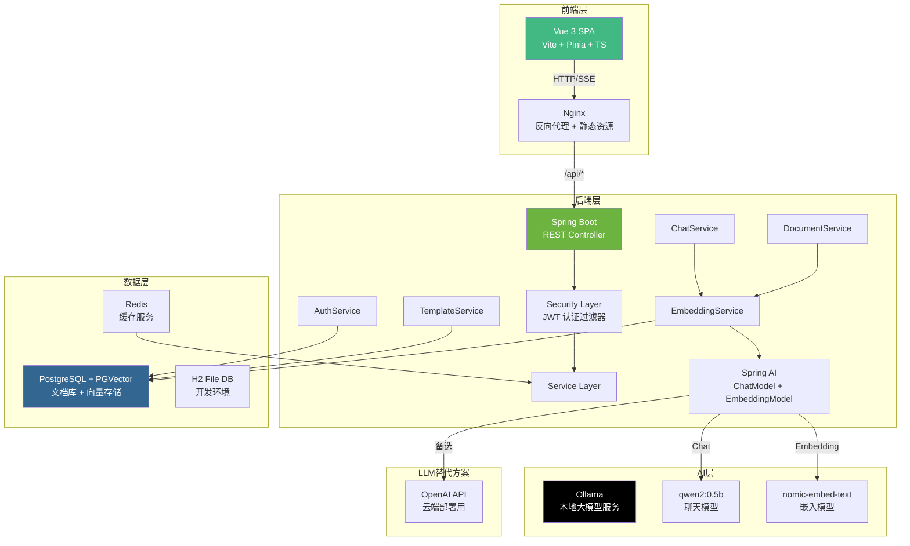

# RAG 智能知识库问答系统

基于检索增强生成（RAG）技术的企业级智能问答平台，支持本地大模型离线调用、文档知识库管理、流式 AI 对话、用户权限管控等核心能力。

[](https://spring.io/projects/spring-boot)
[](https://vuejs.org/)
[](https://www.postgresql.org/)
[](LICENSE)

> **项目链接**: [GitHub](https://github.com/cs-sbs/personal-project-ZhangYN1203)
>
> **在线体验**: <!-- 部署后在此填入 Vercel/Netlify URL -->

---

## 目录

- [技术栈](#技术栈)
- [系统架构](#系统架构)
- [核心功能](#核心功能)
- [快速开始](#快速开始)
- [API 文档](#api-文档)
- [Prompt 模板设计](#prompt-模板设计)
- [项目结构](#项目结构)
- [部署指南](#部署指南)
- [许可证](#许可证)

---

## 技术栈

### 后端
- **框架**: Spring Boot 3.2.5
- **AI**: Spring AI + Ollama（本地大模型）/ OpenAI（云端部署）
- **数据库**: PostgreSQL 16 + PGVector（向量数据库）
- **缓存**: Redis
- **安全**: Spring Security + JWT
- **文档**: SpringDoc OpenAPI 3

### 前端
- **框架**: Vue 3 + TypeScript
- **构建**: Vite 5
- **状态管理**: Pinia
- **UI 组件**: Element Plus
- **HTTP**: Axios
- **Markdown**: Marked

### 部署
- **容器化**: Docker + Docker Compose
- **大模型**: Ollama（支持 qwen2:0.5b 等开源模型）

---

## 系统架构



### 交互流程说明

1. **用户认证**: 前端发送登录请求 → Spring Security JWT 过滤器验证 → 签发 Token
2. **文档上传**: 用户上传 PDF/Word/TXT → 后端提取文本 → 分块 → 调用嵌入模型生成向量 → 存入 PGVector
3. **智能问答**: 用户提问 → 向量检索 Top-K 相关文档 → 构建 Prompt（含检索上下文）→ 调用 LLM → SSE 流式返回 → Markdown 渲染展示
4. **SSE 流式**: 后端使用 `SseEmitter` 逐 token 推送 → 前端 `ReadableStream` 实时拼接 → 完成后发送引用来源

---

## 核心功能

### 1. 用户权限模块
- 用户注册、登录、注销
- JWT 无状态认证（Access Token 24h / Refresh Token 7d）
- 角色权限管理（USER/ADMIN）
- 自动刷新令牌

### 2. 知识库管理模块
- 支持 TXT、PDF、Word 文档上传
- 系统预置样本文档（云计算、Java、RAG、Spring）
- 自动文档分割和向量化存储
- 文档分类管理
- 批量删除功能

### 3. 智能问答模块
- 语义检索匹配相关文档
- 结合上下文生成答案
- SSE 流式输出
- 历史对话管理

### 4. Prompt 模板管理
- 自定义提示词模板
- `{{variable}}` 占位符替换
- 分类管理
- 使用统计

---

## 快速开始

### 方式一：Docker 一键部署（推荐）

```bash
# 1. 确保安装 Docker 和 Docker Compose
# 2. 启动所有服务
docker-compose up -d

# 3. 等待服务启动（约 2-3 分钟）
docker-compose logs -f

# 4. 访问应用
# 前端：http://localhost
# 后端 API: http://localhost:8080
# Swagger 文档：http://localhost:8080/swagger-ui.html
```

### 方式二：本地手动启动

#### 前置条件
- JDK 21+
- Node.js 18+
- Ollama（用于本地 AI 模型）

#### 1. 启动 Ollama 并拉取模型
```bash
ollama serve
ollama pull qwen2:0.5b
ollama pull nomic-embed-text
```

#### 2. 启动后端
```bash
cd personal-project-ZhangYN1203-main
./mvnw spring-boot:run
```

#### 3. 启动前端
```bash
cd frontend
npm install
npm run dev
```

访问 http://localhost:3000

---

## API 文档

启动后端后访问 Swagger UI：http://localhost:8080/swagger-ui.html

### 认证接口
| 方法 | 路径 | 说明 |
|------|------|------|
| POST | `/api/auth/register` | 用户注册 |
| POST | `/api/auth/login` | 用户登录 |
| POST | `/api/auth/refresh` | 刷新令牌 |

### 聊天接口
| 方法 | 路径 | 说明 |
|------|------|------|
| POST | `/api/chat` | 发送消息（非流式） |
| GET | `/api/chat/stream` | 流式对话（SSE） |
| GET | `/api/chat/history/{id}` | 获取对话历史 |
| GET | `/api/chat/conversations` | 获取会话列表 |
| DELETE | `/api/chat/history/{id}` | 删除对话 |

### 文档接口
| 方法 | 路径 | 说明 |
|------|------|------|
| POST | `/api/documents` | 上传文档 |
| GET | `/api/documents` | 获取文档列表 |
| DELETE | `/api/documents/{id}` | 删除文档 |

### 模板接口
| 方法 | 路径 | 说明 |
|------|------|------|
| GET | `/api/templates` | 获取模板列表 |
| POST | `/api/templates` | 创建模板 |
| PUT | `/api/templates/{id}` | 更新模板 |
| DELETE | `/api/templates/{id}` | 删除模板 |

---

## Prompt 模板设计

详见 [docs/Prompt 报告.md](docs/Prompt%20报告.md)

系统内置了 RAG 场景的默认 Prompt 模板，支持通过管理界面自定义。

---

## 项目结构

```
personal-project-ZhangYN1203-main/
├── src/main/java/com/example/app/
│   ├── config/           # 配置类（安全、JWT、AI、数据初始化）
│   ├── controller/       # REST API 控制器
│   ├── service/          # 业务逻辑层（Chat、Document、Auth、Template）
│   ├── repository/       # 数据访问层
│   ├── entity/           # JPA 实体
│   └── dto/              # 数据传输对象
├── frontend/             # Vue3 前端项目
│   ├── src/
│   │   ├── api/          # API 调用 + 类型定义
│   │   ├── views/        # 页面组件（Chat、Documents、Templates、Config）
│   │   ├── components/   # 通用组件（ChatMessage、ChatInput、ChatSidebar）
│   │   ├── stores/       # Pinia 状态管理
│   │   └── router/       # 路由配置
│   └── package.json
├── docker-compose.yml    # Docker 编排
├── Dockerfile            # 后端 Docker 镜像
├── render.yml            # Render 部署配置
├── vercel.json           # Vercel 部署配置
└── docs/
    ├── 5.23记录.md
    └── Prompt 报告.md
```

---

## 部署指南

### 前端部署到 Netlify（推荐）

[](https://app.netlify.com/start)

1. 登录 [Netlify](https://app.netlify.com)
2. 点击 **Add new site → Import an existing project**
3. 连接 GitHub，选择 `cs-sbs/personal-project-ZhangYN1203`
4. 构建设置自动读取 `netlify.toml`：
   - Build command: `npm run build`
   - Publish directory: `dist`
5. 点击 **Deploy**
6. 部署完成后，在 `netlify.toml` 中替换后端 URL，重新部署

### 前端部署到 Vercel

1. 登录 [Vercel](https://vercel.com)
2. 点击 **Add New → Project**
3. 导入 GitHub 仓库
4. Framework preset: **Vite**
5. Root Directory: `frontend`
6. 部署完成后配置环境变量

### 后端部署到 Render

1. 登录 [Render](https://render.com)
2. 点击 **New + → Web Service**
3. 连接 GitHub 仓库
4. Render 自动识别 `render.yml`，点击 **Apply**
5. 设置环境变量 `OPENAI_API_KEY`

> 注意：Render 需要 OpenAI API Key（不能在 Render 上运行 Ollama），部署后需在 `application-openai.yml` 中配置 API Key。

### Docker 本地部署

```bash
docker-compose up -d
```

---

## 开发重难点解决方案

### 1. 多格式文档解析
- PDF: Apache PDFBox
- Word: Apache POI
- TXT: 原生支持

### 2. 向量检索优化
- 文本分块：1000 字符/块
- 余弦相似度匹配
- 限制返回数量（Top 5）

### 3. SSE 流式处理
- Spring SseEmitter
- 前端 ReadableStream
- streamDone 标记退出机制

### 4. H2 兼容设计
- EmbeddingService 自动检测数据库类型
- H2 环境下使用简化 SQL，PG 环境下使用 pgvector 原生语法

---

## 系统要求

### 本地开发
- JDK 21+
- Maven 3.6+
- Node.js 18+
- Ollama
- Docker 20+（可选）

### 服务器部署
- 内存 4GB+
- Docker 20+
- 可选：NVIDIA GPU（加速推理）

---

## 许可证

MIT License

---

## 联系方式

如有问题，请提交 [Issue](https://github.com/cs-sbs/personal-project-ZhangYN1203/issues) 或联系开发者。