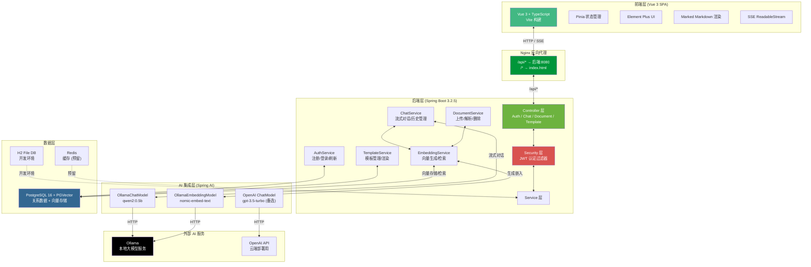
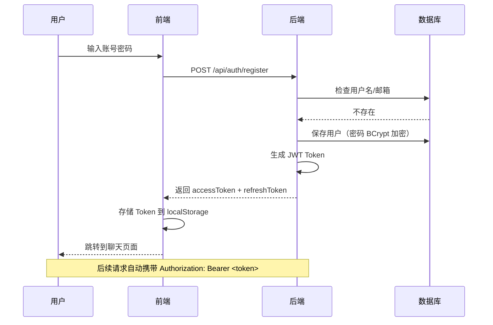
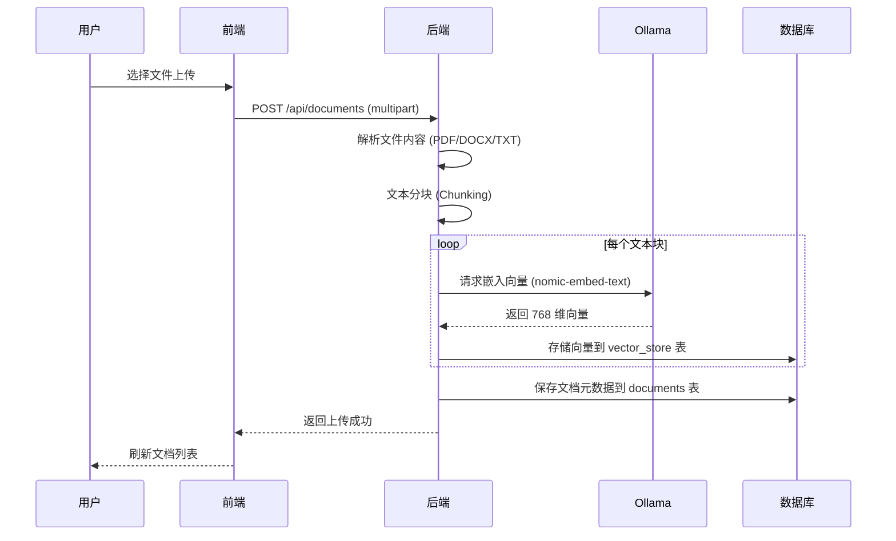
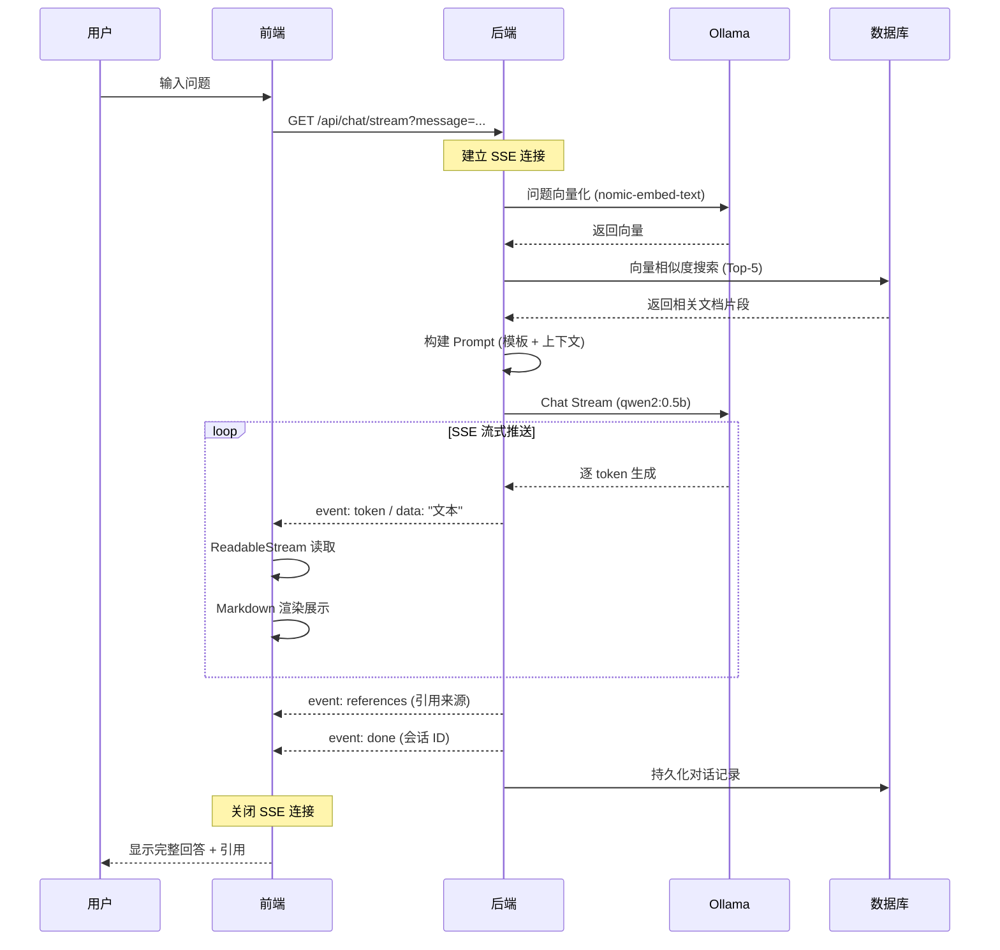
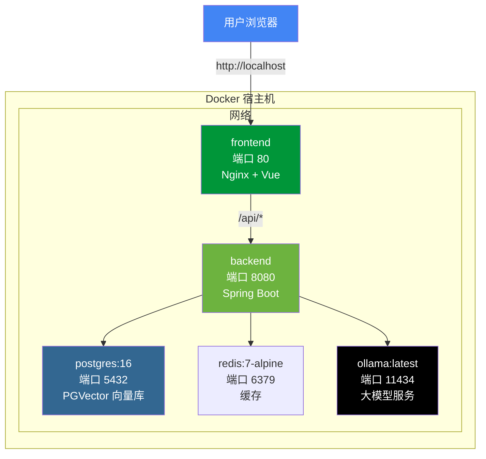

# 系统架构图

本文件包含系统的架构图和交互流程说明，使用 Mermaid 语法绘制。
在 GitHub 上查看时会自动渲染为图表。

---

## 1. 整体系统架构

---

## 2. 交互流程

### 2.1 用户认证流程

### 2.2 文档上传与向量化

### 2.3 智能问答流程

---

## 3. 部署架构（Docker）

---

## 4. 组件依赖关系

| 组件 | 依赖 | 说明 |
|------|------|------|
| Spring Boot Backend | PostgreSQL, Redis, Ollama | 核心业务逻辑 |
| Vue 3 Frontend | Backend API | 用户界面 |
| Ollama | - | 独立的 AI 模型服务 |
| PostgreSQL | - | 持久化数据 + 向量检索 |

> 注：开发环境下使用 H2 文件数据库替代 PostgreSQL，使用本地 Ollama 服务替代容器化 Ollama。