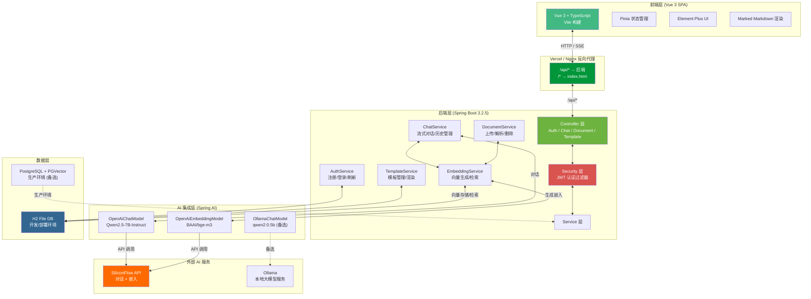
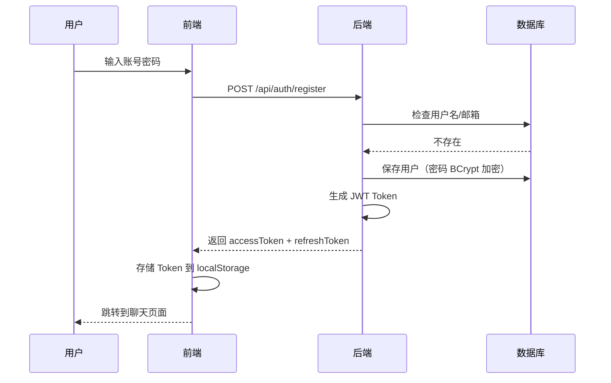
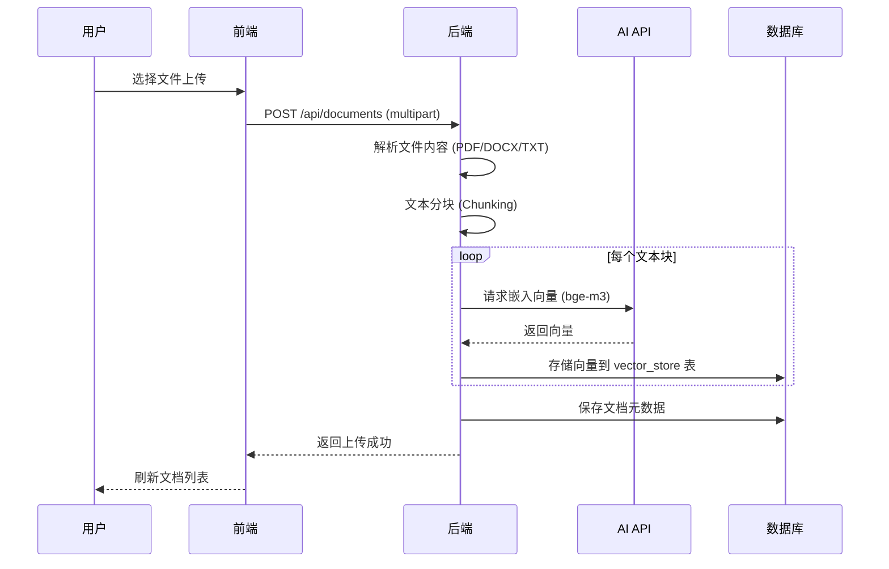
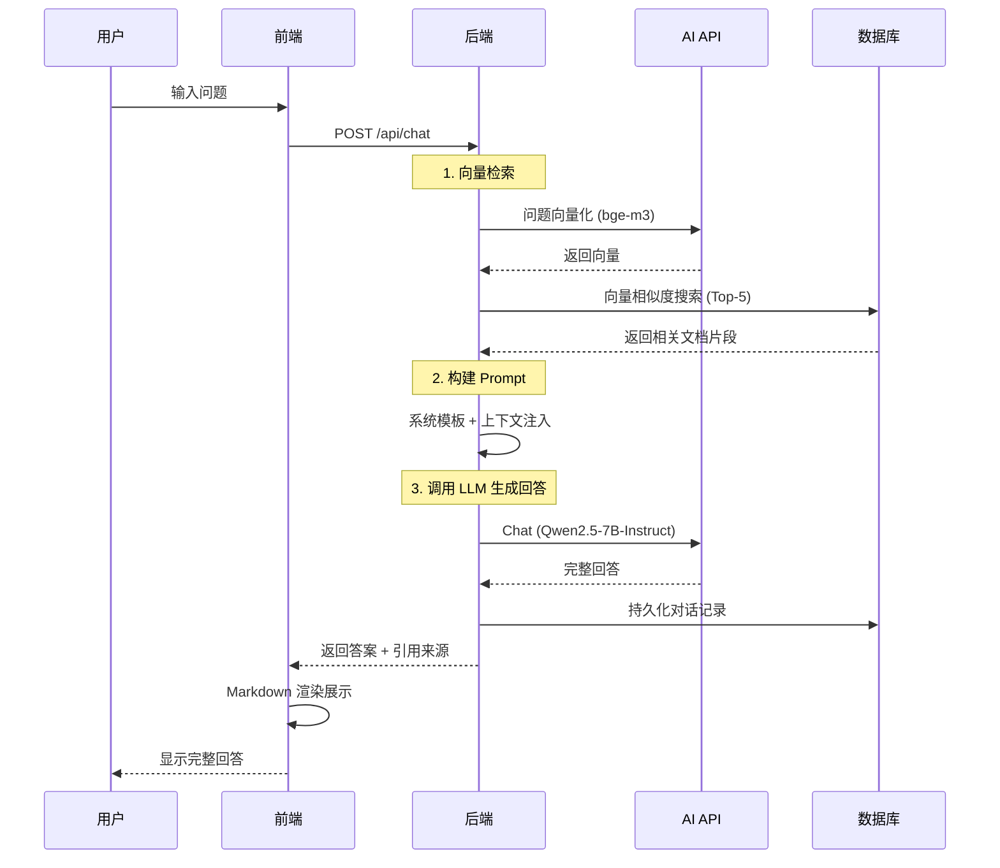
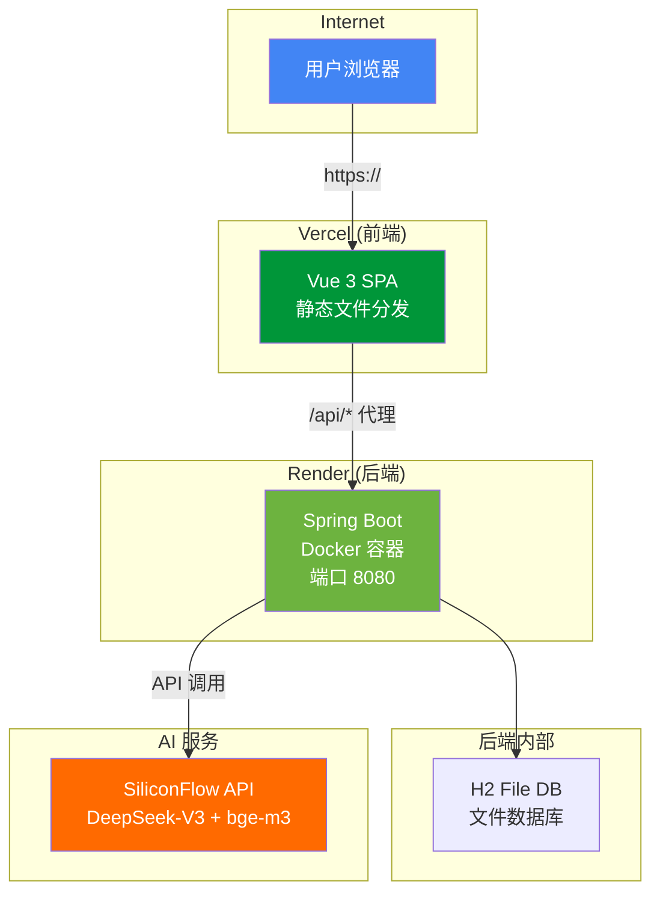

# 系统架构图

本文件包含系统的架构图和交互流程说明，使用 Mermaid 语法绘制。
在 GitHub 上查看时会自动渲染为图表。

---

## 1. 整体系统架构

---

## 2. 交互流程

### 2.1 用户认证流程

### 2.2 文档上传与向量化

### 2.3 智能问答流程

---

## 3. 部署架构（生产环境）

---

## 4. 组件依赖关系

| 组件 | 依赖 | 说明 |
|------|------|------|
| Spring Boot Backend | SiliconFlow API、H2/PostgreSQL | 核心业务逻辑 |
| Vue 3 Frontend | Backend API | 用户界面 |
| SiliconFlow API | - | 外部 AI 模型服务（对话+嵌入） |
| H2 / PostgreSQL | - | 持久化数据 + 向量检索 |

> **注：** 生产环境使用 H2 文件数据库 + SiliconFlow API，无需额外部署 PostgreSQL 或 Ollama。
> 开发环境支持切换至本地 Ollama（仅需更改 Spring profile）。